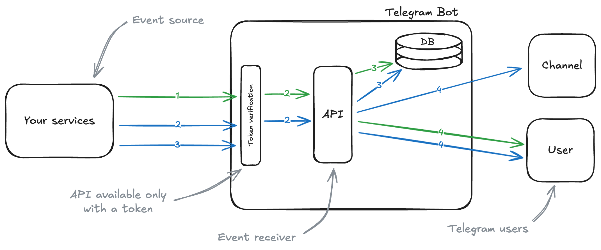

# Telegram Notification Bot

## Navigation

- [Application Description](#application-description)
- [System Architecture](#system-architecture)
- [Environment Configuration](#environment-configuration)
- [Token Generation Algorithm](#token-generation-algorithm)
- [Database Structure](#database-structure)
- [API](#API)
- [Application Testing](#application-testing)
- [Running the Application with Docker](#running-the-application-with-docker)

## Application Description

This Telegram bot provides an API for sending automated notifications via HTTP.

It is designed for integration into existing services, enabling real-time alerts about critical events like server
errors, with support for file attachments such as log files.

### Application Features:

- Interaction with the bot through the API.
- Ability to send attached files.
- Ensures secure interaction between the server and the bot using an authorization token.

### Technologies Used:

- **FastAPI**: Web framework for API creation.
- **Aiogram**: Library for asynchronous interaction with [Telegram Bot API](https://core.telegram.org/bots/api).
- **SQLAlchemy**: ORM for working with the database.
- **Alembic**: Tool for managing database migrations.
- **Pytest**: Framework for writing and running tests.
- **Docker**: Tool for containerizing the application.
- **UV**: Tool for dependency and package management.

## System Architecture



## Environment Configuration

| Parameter           | Description                                                                            | Default value                                    |
|---------------------|----------------------------------------------------------------------------------------|--------------------------------------------------|
| `API__ACCESS_TOKEN` | Access token for API interaction                                                       | **Required**                                     |
| `API__RUN__HOST`    | Host on which the API will run. If running in a container, specify the container name. | `tg-notify-bot` (Docker container name)          |
| `API__RUN__PORT`    | Port on which the API will be available                                                | `8000`                                           |
| `API__RUN__RELOAD`  | Server auto-reload flag (`1` – enabled, `0` – disabled)                                | `0`                                              |
| `DB__HOST`          | Database host. If PostgreSQL is running in a container, specify the container name.    | `tg-notify-bot-postgres` (Docker container name) |
| `DB__PORT`          | Port for connecting to the PostgreSQL database                                         | `5432`                                           |
| `DB__USER`          | Database username                                                                      | `postgres`                                       |
| `DB__PASSWORD`      | Database user password                                                                 | `postgres`                                       |
| `DB__DATABASE`      | Name of the database used by the application                                           | `notification`                                   |
| `DB__ECHO`          | SQL query logging (`1` – enabled, `0` – disabled)                                      | `0`                                              |
| `DB__ECHO_POOL`     | Connection pool logging (`1` – enabled, `0` – disabled)                                | `0`                                              |
| `DB__POOL_SIZE`     | Maximum number of connections in the database pool                                     | `50`                                             |
| `DB__MAX_OVERFLOW`  | Maximum number of additional connections created when the pool is overloaded           | `10`                                             |
| `TG_BOT__TOKEN`     | Telegram bot token used for sending notifications                                      | **Required**                                     |
| `TEST_CHAT_ID`      | Chat ID used for test notifications                                                    | **Required**                                     |

> [!WARNING]\
> Before starting the application, create a `.env` file and specify all required variables.

## Token Generation Algorithm

The authentication token is generated using the **HMAC-SHA256** algorithm, where the key is `API__ACCESS_TOKEN` from
`.env`.

### **Algorithm:**

1. Retrieve configuration parameters.
2. Generate a Unix timestamp.
3. Generate an HMAC hash using SHA-256 based on `API__ACCESS_TOKEN` and the current time.

### **Token Generation Code:**

```python
import hashlib
import hmac
import time

from config import config


def generate_token() -> str:
    current_time = str(int(time.time()))
    return hmac.new(
        config.api.access_token.encode(),
        current_time.encode(),
        hashlib.sha256,
    ).hexdigest()
```

## Database Structure

The application uses PostgreSQL and includes three main tables: `notification`, `document`, and `notification_document`,
which establishes a _many-to-many_ relationship between notifications and documents.

### **Table `notification`**

| Field        | Type                     | Description                                                                                                               |
|--------------|--------------------------|---------------------------------------------------------------------------------------------------------------------------|
| `id`         | Integer                  | Unique notification identifier                                                                                            |
| `chat_id`    | Bigint                   | ID of the chat or channel where the message will be sent                                                                  |
| `message`    | Text                     | Message body in [MarkdownV2](https://core.telegram.org/bots/api#markdownv2-style) format                                  |
| `button_url` | Text \| Null             | _(Optional)_ URL for an inline button in the message. If provided, the message will include a button linking to this URL. |
| `created_at` | Timestamp with time zone | Time of notification sending in ISO 8601 format                                                                           |

**ORM Model:**

```python
class Notification(Base, TableNameMixin):
    id: Mapped[int] = mapped_column(primary_key=True)
    chat_id: Mapped[int] = mapped_column(BIGINT, index=True)
    message: Mapped[str] = mapped_column(Text())
    button_url: Mapped[str | None] = mapped_column(Text(), nullable=True)
    created_at: Mapped[datetime] = mapped_column(
        TIMESTAMP(timezone=True),
        server_default=func.now(),
        index=True,
    )

    documents: Mapped[List["Document"]] = relationship(
        secondary="notification_document",
        back_populates="notifications",
        lazy="selectin",
        cascade="save-update",
    )
```

### **Table `document`**

| Field    | Type    | Description                |
|----------|---------|----------------------------|
| `id`     | Integer | Unique document identifier |
| `buffer` | Bytea   | File in Base64 format      |
| `name`   | Text    | Document name              |

**ORM Model:**

```python
class Document(Base, TableNameMixin):
    id: Mapped[int] = mapped_column(primary_key=True)
    buffer: Mapped[bytes] = mapped_column(LargeBinary, index=True)
    name: Mapped[str] = mapped_column(Text(), index=True)

    notifications: Mapped[List["Notification"]] = relationship(
        secondary="notification_document",
        back_populates="documents",
        lazy="joined",
    )
```

### **Table `notification_document`** (Association Table)

| Field             | Type    | Description                                       |
|-------------------|---------|---------------------------------------------------|
| `notification_id` | Integer | Notification reference (CASCADE on delete/update) |
| `document_id`     | Integer | Document reference (CASCADE on delete/update)     |

**ORM Model:**

```python
class NotificationDocument(Base, TableNameMixin):
    notification_id: Mapped[int] = mapped_column(
        ForeignKey("notification.id", ondelete="CASCADE", onupdate="CASCADE"),
        primary_key=True,
    )
    document_id: Mapped[int] = mapped_column(
        ForeignKey("document.id", ondelete="CASCADE", onupdate="CASCADE"),
        primary_key=True,
    )

```

## API

### **Send a notification**

```
POST /api/v1/notifications
```

- **Method:** `POST`
- **Endpoint:** `/api/v1/notifications`
- **Description:** Sends a notification to the specified chat IDs, which can include a message, optional button, and
  optional documents.

### **Request Headers:**

| Header        | Type   | Description                |
|---------------|--------|----------------------------|
| Authorization | String | API key for authentication |

### **Request Parameters:**

| Field       | Type              | Description                                                                                                               |
|-------------|-------------------|---------------------------------------------------------------------------------------------------------------------------|
| `chatIds`   | Array of integers | List of chat or channel IDs where the message will be sent                                                                |
| `message`   | String            | Message body in [MarkdownV2](https://core.telegram.org/bots/api#markdownv2-style) format                                  |
| `buttonUrl` | String \| Null    | _(Optional)_ URL for an inline button in the message. If provided, the message will include a button linking to this URL. |
| `documents` | Array \| Null     | _(Optional)_ List of attached documents                                                                                   |

**Description of `document` object:**

| Field    | Type   | Description           |
|----------|--------|-----------------------|
| `buffer` | String | File in Base64 format |
| `name`   | String | Document name         |

### **Example Request:**

```json
{
  "chatIds": [
    123456789,
    987654321
  ],
  "message": "Hello, this is a message with *markdown* formatting",
  "buttonUrl": "https://example.com",
  "documents": [
    {
      "buffer": "SGVsbG8gd29ybGQ=",
      "name": "Document 1.pdf"
    },
    {
      "buffer": "U29tZSBuZXcgZGF0YQ==",
      "name": "Document 2.pdf"
    }
  ]
}
```

### **Response:**

| Field       | Type   | Description                                     |
|-------------|--------|-------------------------------------------------|
| `createdAt` | String | Time of notification sending in ISO 8601 format |

**Example Response:**

```json
{
  "chatIds": [
    123456789,
    987654321
  ],
  "message": "Hello, this is a message with *markdown* formatting",
  "buttonUrl": "https://example.com",
  "documents": [
    {
      "buffer": "SGVsbG8gd29ybGQ=",
      "name": "Document 1.pdf"
    },
    {
      "buffer": "U29tZSBuZXcgZGF0YQ==",
      "name": "Document 2.pdf"
    }
  ],
  "createdAt": "2024-06-06T12:00:02Z"
}
```

### **Possible Response Codes:**

| Code                        | Description               |
|-----------------------------|---------------------------|
| `201 Created`               | Message successfully sent |
| `403 Forbidden`             | Invalid or missing token  |
| `422 Unprocessable Entity`  | Validation error          |
| `500 Internal Server Error` | Server error              |
| `502 Bad Gateway`           | Upstream server error     |

## Application Testing

The project uses the **pytest** library for testing.

During test execution, the Telegram bot will send a series of test messages. These tests cover different scenarios such
as sending a message with or without an attachment, and with or without an inline button.

### **Running Tests:**

```sh
pytest
```

> [!WARNING]\
> Ensure that `TG_BOT__TOKEN` and `TEST_CHAT_ID` parameters are specified in the `.env` file.

### **Tested Scenarios:**

#### **✅ Successful message sending:**

- Text message without attachments.
- Text message with an attachment.
- Text message with an inline button, without an attachment.
- Text message with an inline button and an attachment.

#### **❌ Errors in sending:**

- Sending without an authentication token.
- Sending with an invalid authentication token.
- Sending without `chatIds` field.
- Sending with an empty `chatIds` list.
- Sending with an invalid `chatIds` value (e.g., wrong type or format).
- Sending without `message` field.

## Running the Application with Docker

1. Navigate to the project root directory.

2. Configure `.env`.

> [!NOTE]\
> Each `.env` parameter is described in the [environment configuration](#environment-configuration) section.

3. Build and start the containers:

   ```sh
   docker compose up --build -d
   ```